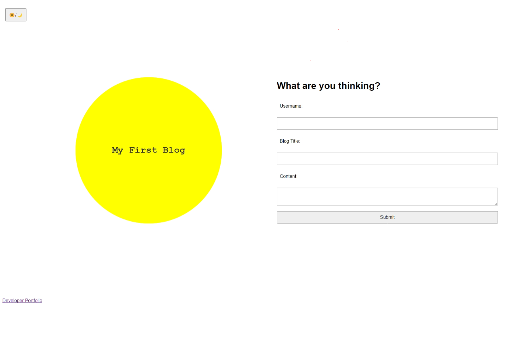
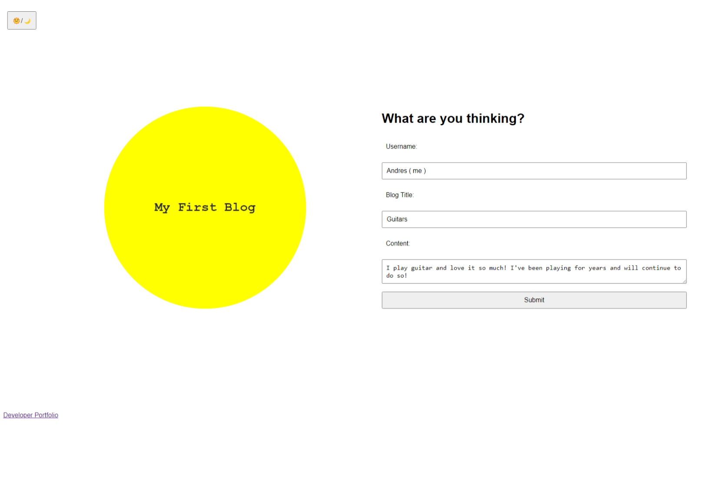
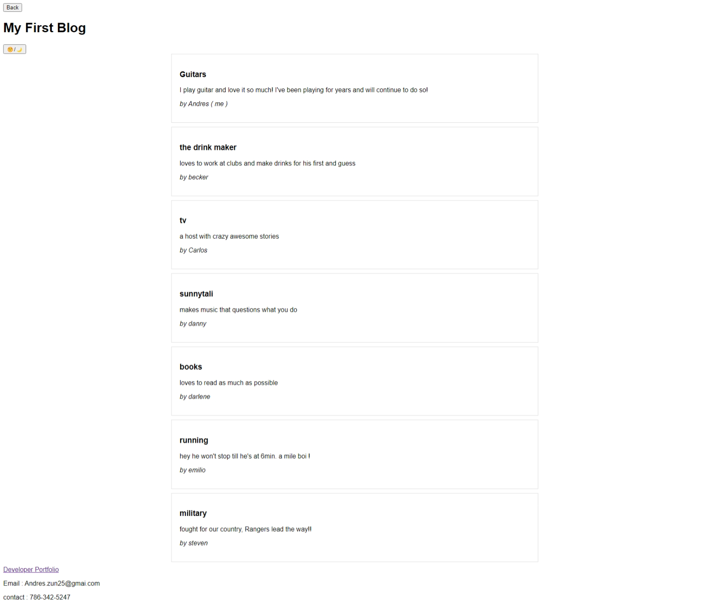
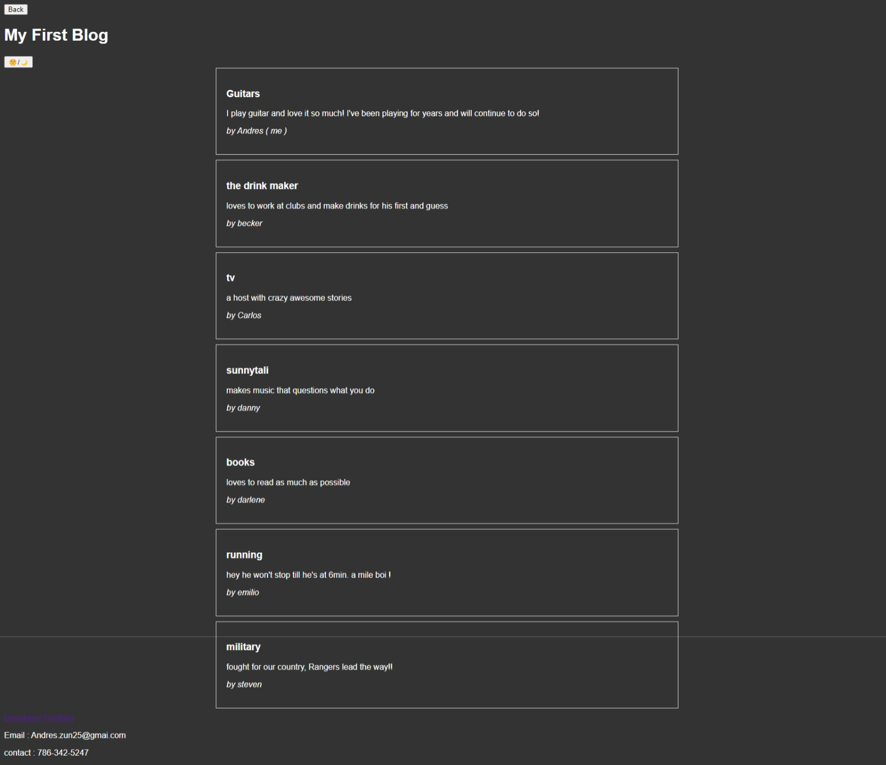

# My First Blog !!  ( Module 4 )

## Description

This is My First blog project, it is built using  2HTML, 3 CSS, and 2 JavaScript files. In this blog you can talk about people and make a list. Starting with a username then give a title and content. Then it will lead you to a list and you can also chasnge that list page into light mode or dark mode. so come and write, what are you thinking !

## Acceptance Criteria

GIVEN a personal blog
WHEN I load the app,
THEN I am presented with the landing page containing a form with labels and inputs for username, blog title, and blog content.
WHEN I submit the form,
THEN blog post data is stored to localStorage.
WHEN the form submits,
THEN I am redirected to the posts page.
WHEN I enter try to submit a form without a username, title, or content,
THEN I am presented with a message that prompts me to complete the form.
WHEN I view the posts page,
THEN I am presented with a header, with a light mode/dark mode toggle, and a "Back" button.
WHEN I click the light mode/dark mode toggle,
THEN the page content's styles update to reflect the selection.
WHEN I click the "Back" button,
THEN I am redirected back to the landing page where I can input more blog entries.
WHEN I view the main content,
THEN I am presented with a list of blog posts that are pulled from localStorage.
WHEN I view localStorage,
THEN I am presented with a JSON array of blog post objects, each including the post author's username, title of the post, and post's content.
WHEN I take a closer look at a single blog entry in the list,
THEN I can see the title, the content, and the author of the post.
WHEN I view the footer,
THEN I am presented with a link to the developer's portfolio.

## Get Started
* here is the way the files should be orgasnized 

my-blog
├── assets
│   ├── css
│   │   ├── blog.css
│   │   ├── form.css
│   │   └── styles.css
│   └── js
│       ├── blog.js
│       ├── form.js
│       └── logic.js
├── index.html
├── blog.html
└── README.md

## Installation 

1. create a GitHub
2. name it My First Blog !!  ( Module 4 ) 
3. clone it to me desktop
4. open on VScode and arrange the files how as shown up above
5. then start with the htmls
6. then work on each css file and link it to the htmls
7. then move on to the js files and work on that make sure its link with the htmls
8. test it and add the things that make it look closer to the sample
9. make sure to add your porfolio, email, and contact
10. run it and test it, checking the code
11. after push to GitHub

* The image shows my personal use of the My First Blog !! should look like :

